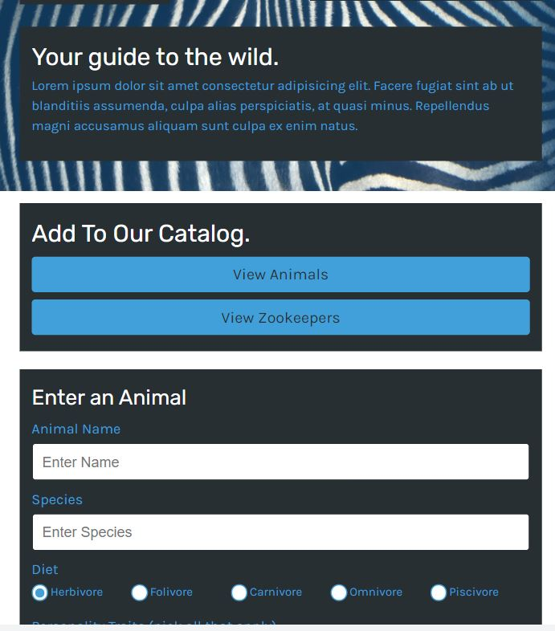

# Zookeepr

  
    
  
   
  
   
  
   
  
   
  
  
  ## Description
  
   Application that allows a zoo to update and maintain the catalog of animals, and track their zookeepers. Users can search for animals and zookeepers using several peramaters, and they are also able to add animals and zookeepers. 
 
  ## Table of Contents
  - [Description](#description)
  - [Documentation](#documentation)
  - [Usage](#usage)
  - [Screenshot](#screenshot)
  - [Features](#features)
  - [Acknowledgements](#acknowledgements)
  - [License](#license)
  - [Testing](#testing)
  - [Contact](#contact)

  ## Documentation
  
 
  ## Usage
  The application is ran locally via a Node.js web server using Express.js. The production ready application is deployed on Heroku. 

  ## Screenshot
  

  ## Features
  express.js, Heroku, Node.js, Jest, Insomnia, GET requests using parameters, POST routes, dynamic HTML
  
  # Acknowledgements
  Rob Atalla
    
  ## License
  
   
  Permission to use this application is granted under the ISC license. <https://opensource.org/licenses/ISC>

  ## Testing
  GET and POST routes verified using Insomnia. Validation files contained in the _tests_ folder were ran against the Jest testing suite. 

  ## Contact:
  Holler at me! <a href="mailto:rob.atalla@gmail.com">rob.atalla@gmail.com</a>